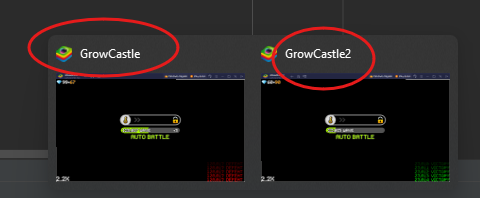
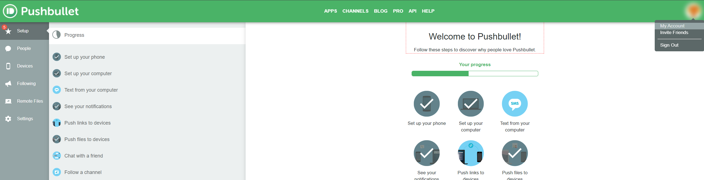
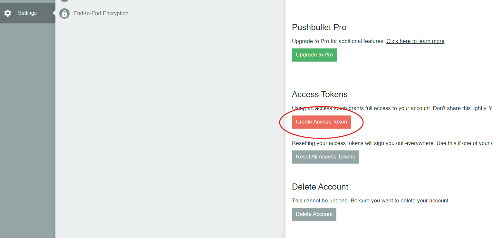
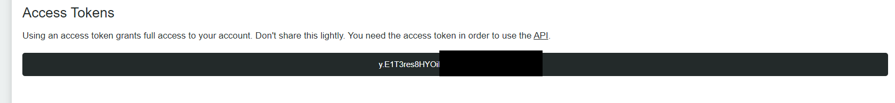
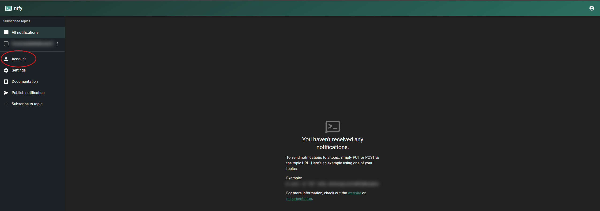
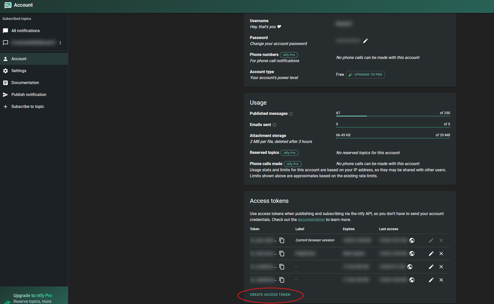

# GrowCastle-Watcher

GrowCastle-Watcher is an application that tries to watch if your autobattle failed and will inform you about that

- How it works?

        It takes screenshots of your grow castle application in intervals then checks for red pixels in victory/defeat rows in bottom right corner

- Is it possible to run it on android?

        No, it's not. This application was made with emulator players in mind, at the moment it will work only on windows.
        I did test it with bluestacks only but it should work with every emulator. If it doesn't please submit an issue about that

- How will I get a notification about failed wave?

        You can get notification either by pushbullet.com or ntfy.sh for both of them you will need to generate access token
        then set it up in application.properties file

- How to run the application?
 
        Download GrowCastle-Watcher.zip file from releases then unzip it in whatever location you want
        Set up everything in application.properties file (you can open it in notepad)
        open command prompt as administrator, navigate into unzipped folder, type java -jar GrowCastle-Watcher.jar
        that's it

# All functions of GrowCastle-Watcher

1. Takes screenshot of emulator window, checks if energy saving mode is on (black screen with 5 results of last waves in bottom right corner)
2. Will send notification to you if you lost X times (you can set up the count of losses before notification is send in application.properties file)
3. Can send image instead, so you will see exactly which waves failed (can be turned on in application.properties)
4. You can send message to it with a command

    - $menu - App will send you back available commands to use
    - $1    - App will send you screenshots of all your windows with grow castle apps (you can set multiple windows in properties file
    - $2    - (requires running from cmd with administrator privilages) - It will close rdp sessions on your PC and log your account in

        
        Why do we need $2 command? Well you can connect into your pc with remote desktop bu after closing connection your pc is locked
        Which means that app cannot take a screenshot anymore, so to make it work again after using rdp just send $2 to your topic or through pushbullet
        Regaing connection can take somewhere between 10-60 seconds depending so don't hurry too much

5. You can set up multiple windows in application properties. What is a window name? 

# Which notification service shoud You use?

### pushbullet.com 
Pros: Its probably easier to set up and have applications on each and every platform, noone will see your messages if you don't want that to happen.

Cons: Low message limit in free tier (200 something per month +/-)

### ntfy.sh
Pros: High limit of messages in free tier 250 per day, you can set up your own server with it if you want, very fast response times

Cons: you will send messages to public topic with your choosen name so if someone knew that name it would be possible to read your messages, so you will need to create topic name better than test1234 for example

# How to generate auth tokens

## pushbullet.com

1. register/login on pushbullet.com
2. Go to My Account 

3. Create access token 

4. Copy access token and put it into application.properties file

## ntfy.sh

1. register on ntfy.sh
2. Go to Account 

3. Create access token

4. Copy access token and put it into application.properties file

# How it looks live

[demo.mp4](readme/video/demo.mp4)